# Hardening with UFW & Fail2Ban

## UFW

Enabled UFW on the honeypot VM with a default deny on all incoming traffic. Only ports 22 (real SSH for management) and 2222 (Cowrie) are open.

```bash
sudo ufw default deny incoming
sudo ufw default allow outgoing
sudo ufw allow 22/tcp
sudo ufw allow 2222/tcp
sudo ufw enable
```

Everything else gets dropped. If someone tries hitting any other port on this box, it's just gone.

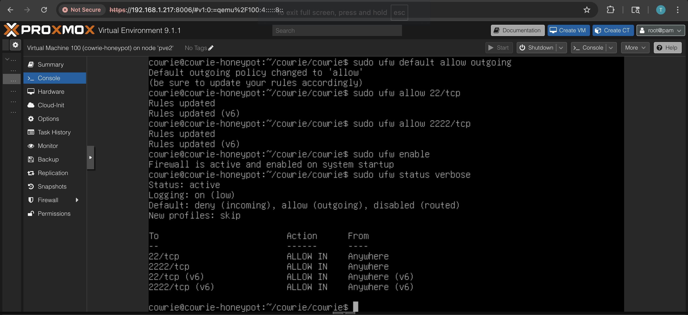

## Blocking a Single IP

To test this out, I SSH'd into the honeypot from Kali (192.168.1.165) first to make sure the connection was working.

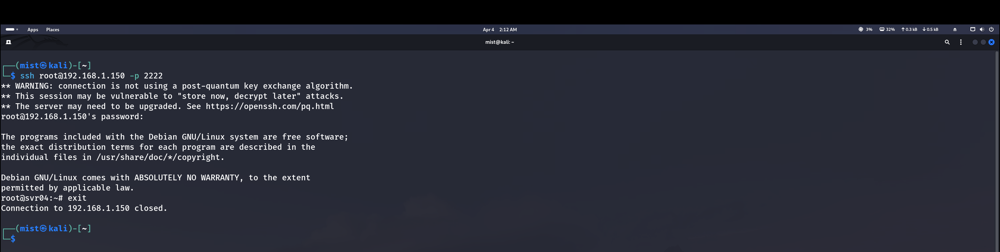

Then on the honeypot, I added a deny rule for that IP. The important thing here is using `ufw insert 1` instead of just `ufw deny`. If you just do `ufw deny`, the allow rules for ports 22 and 2222 get processed first and the traffic goes through anyway. `insert 1` puts the deny rule at the very top so it gets checked before anything else.

```bash
sudo ufw insert 1 deny from 192.168.1.165
sudo ufw status numbered
```

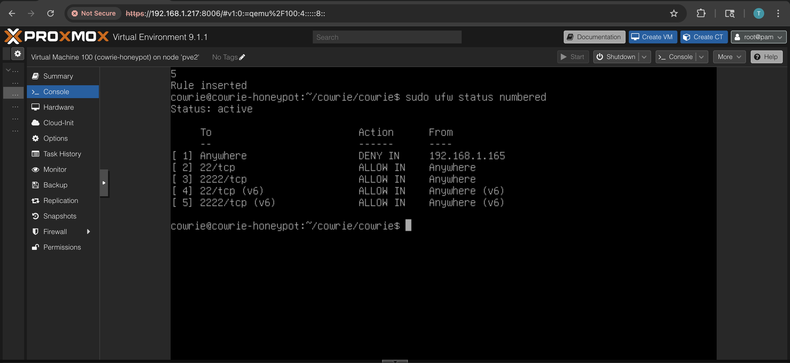

Back on Kali, tried running Hydra and SSH again. Both just hang and eventually time out. The IP is completely blocked from reaching the honeypot.

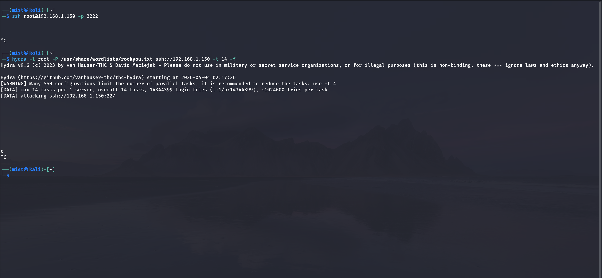

After confirming it works, I deleted the rule to clean up.

```bash
sudo ufw delete deny from 192.168.1.165
```

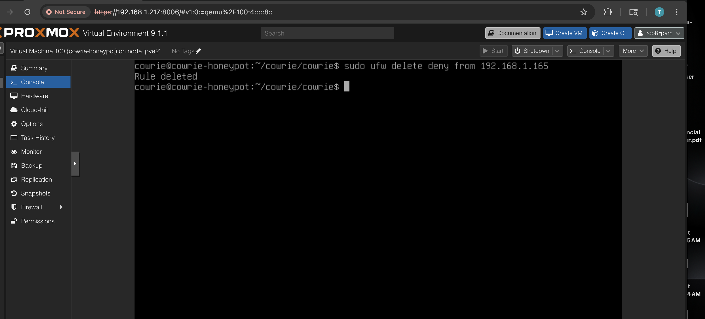

## Blocking a Subnet

Instead of blocking one IP at a time, you can block an entire subnet. This is useful if an attacker has multiple machines on the same network or if you want to block a whole range.

```bash
sudo ufw insert 1 deny from 192.168.1.0/24
sudo ufw status numbered
```

This blocks every IP from 192.168.1.1 to 192.168.1.254.

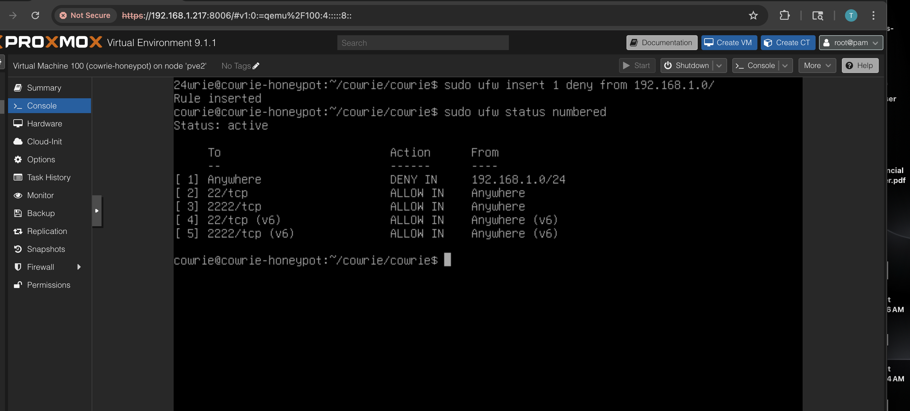

From Kali, SSH hangs again. The entire /24 is blocked.

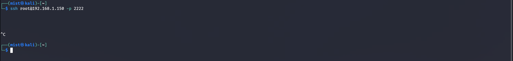

Cleaned up the rule after testing.

```bash
sudo ufw delete deny from 192.168.1.0/24
```

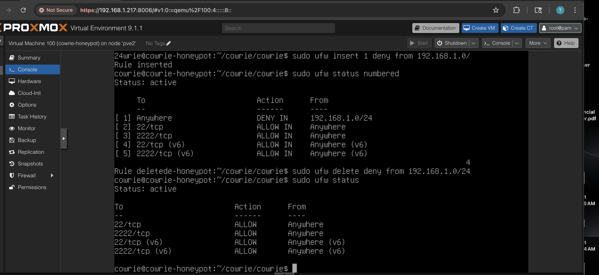

## The Problem

Before fail2ban, Hydra could brute force the honeypot and find passwords without any consequences. It would just keep running through the wordlist until it found matches.

## Fail2Ban Setup

Installed fail2ban on the honeypot VM and created a custom jail for Cowrie. The filter watches Cowrie's log file and matches any login attempt (failed or succeeded) from an IP. If an IP hits 3 login attempts within 60 seconds, it gets banned for 1 hour.

The jail config (`/etc/fail2ban/jail.local`):

```
[cowrie]
enabled = true
filter = cowrie
logpath = /home/cowrie/cowrie/cowrie/var/log/cowrie/cowrie.log
maxretry = 3
findtime = 60
bantime = 3600
port = 2222
```

The filter regex (`/etc/fail2ban/filter.d/cowrie.conf`):

```
[Definition]
failregex = .*\[HoneyPotSSHTransport,\S+,<HOST>\] login attempt .* (failed|succeeded)
```

## Testing It

Ran Hydra again from Kali. It still found 3 passwords but fail2ban caught the login attempts and banned the IP right after.

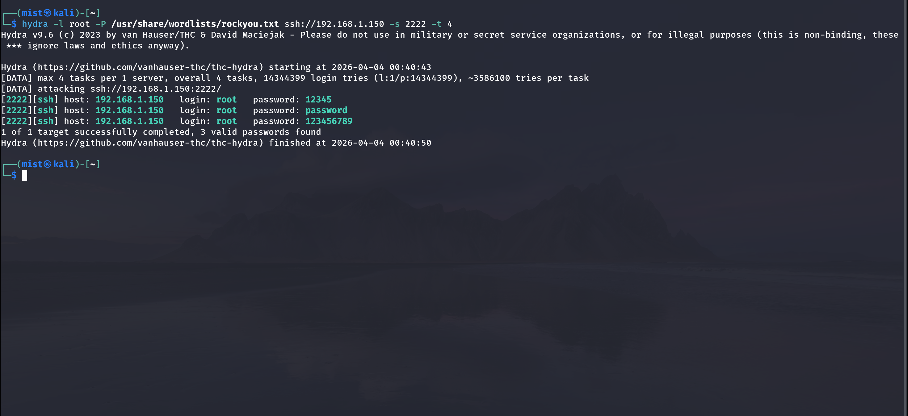

Checking the cowrie jail on the honeypot shows 192.168.1.194 is now banned. 4 total failed attempts detected, 1 IP currently banned.

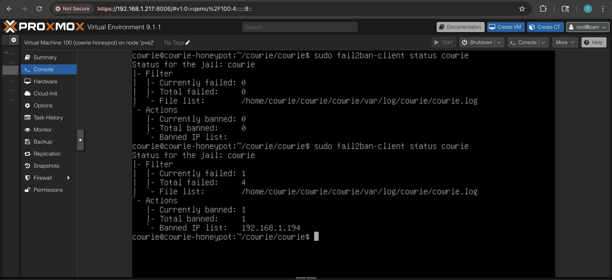

## Confirming the Ban

Tried to SSH back into the honeypot from Kali and got `Connection refused`. The IP is completely blocked on port 2222.

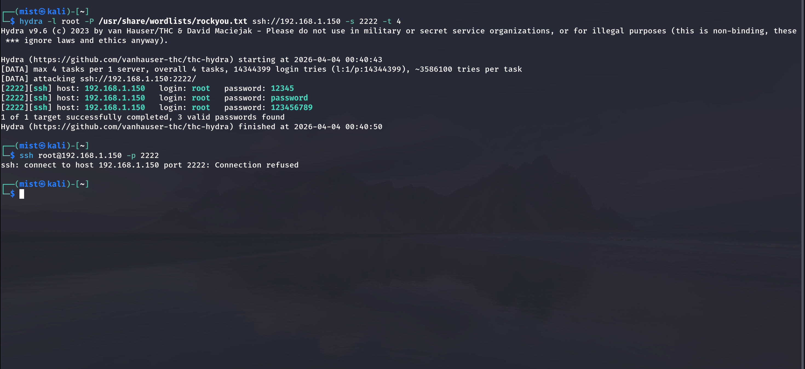

## Fail2Ban Logs in Splunk

The fail2ban log is also forwarded to Splunk through the Universal Forwarder. You can search `sourcetype="fail2ban"` and see the ban event with the IP and timestamp.

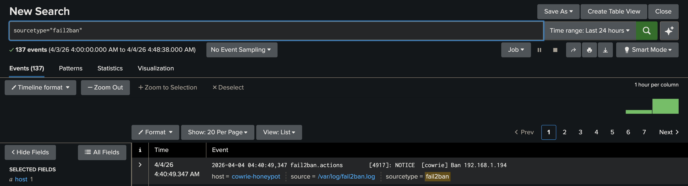
