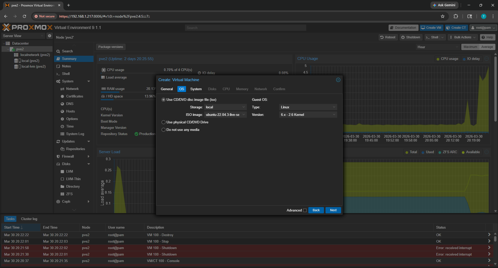
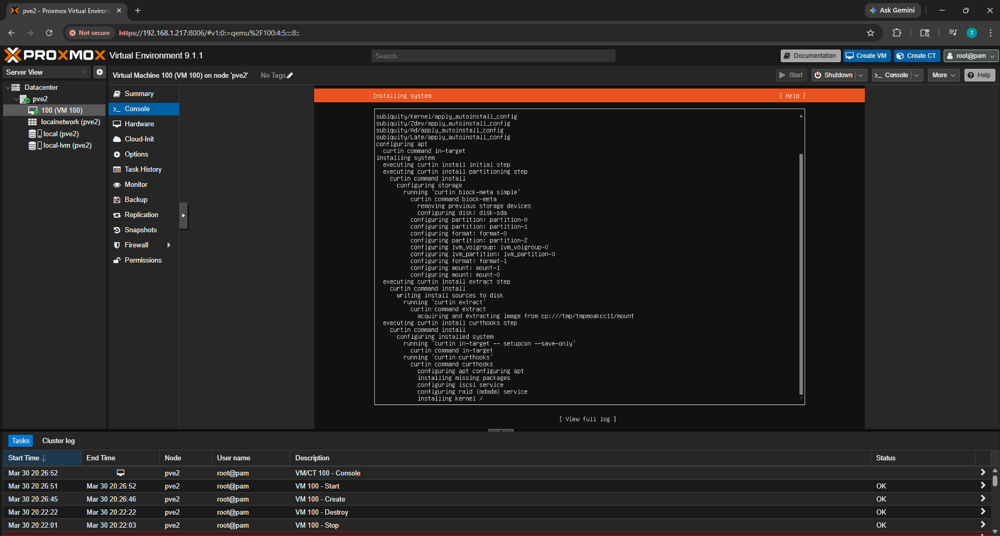
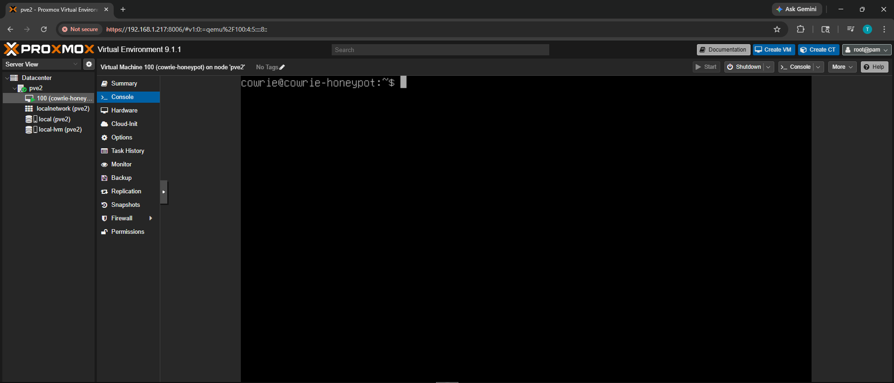
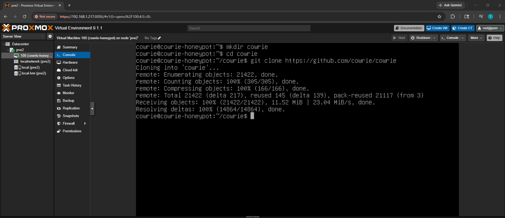
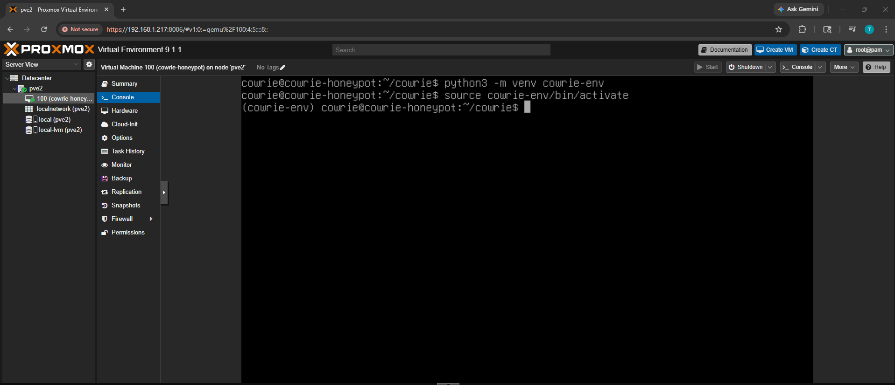
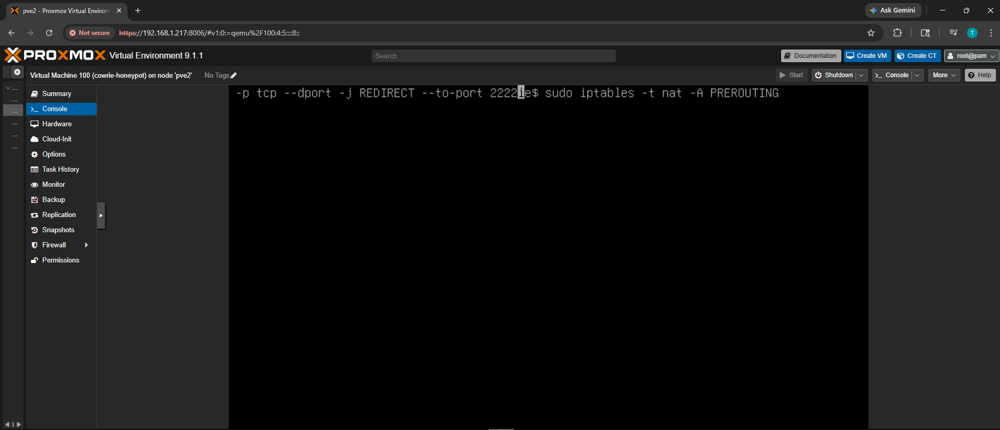
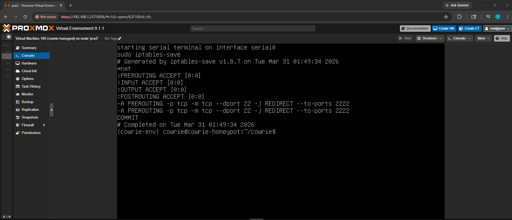
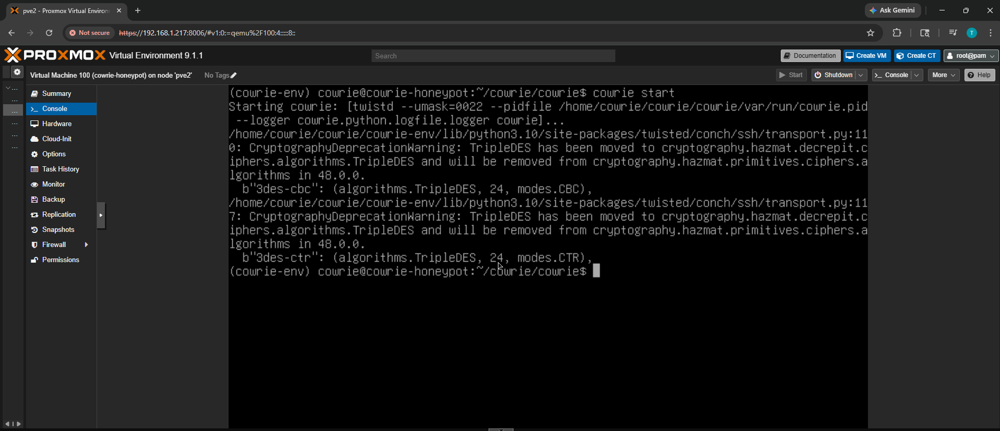
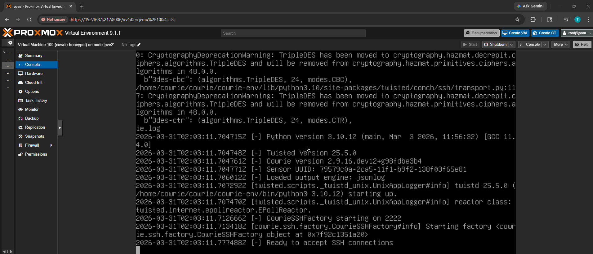

# Installation Steps

Orignal Video I followed - Video = https://youtu.be/uSohtNwQXuI?si=PXeezLlMXO5dqjA1 (they explain it better)

### 1. Create the VM in Proxmox

Creating a new Ubuntu VM (ID 100) on pve2 using a cloud image. 2 cores, 2GB RAM, 32GB disk with cloud-init for automated provisioning.

### 2. Ubuntu cloud-init provisioning

Ubuntu installing automatically via cloud-init (curtin). The cloud image handles OS setup without a manual installer.

### 3. Fresh shell on the honeypot VM

Logged in as `cowrie@cowrie-honeypot` on VM 100. Fresh Ubuntu 22.04 system ready for Cowrie installation.

### 4. Clone the Cowrie repository

Creating a directory and cloning the official Cowrie repo from GitHub.

### 5. Set up the Python virtual environment

Creating and activating a Python virtual environment for Cowrie's dependencies.

### 6. Configure iptables port redirect

Setting up an iptables NAT PREROUTING rule to redirect incoming SSH traffic on port 22 to Cowrie's listening port 2222. This makes the honeypot transparent to attackers.

### 7. Verify iptables rules

Confirming the NAT PREROUTING rules are active with `sudo iptables-save`. The redirect from port 22 to 2222 is in place.

### 8. Start Cowrie

Starting the Cowrie honeypot. TripleDES deprecation warnings are expected and non-breaking.

### 9. Cowrie listening for SSH connections

Cowrie is running and listening on port 2222. The log confirms `CowrieSSHFactory starting on 2222` and `Ready to accept SSH connections`.

